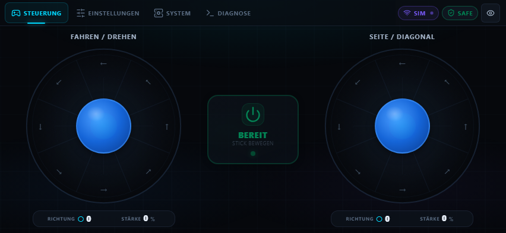

# Mecanum Bot · ESP32

**Ein ESP32, vier Räder und dein Handy als Controller.**

Die Firmware betreibt einen eigenen WLAN-Hotspot, steuert die vier Motoren und liefert die Bedienoberfläche direkt an den Browser. Ein Raspberry Pi, eine Cloud-Verbindung oder eine zusätzliche Handy-App werden dafür nicht benötigt.

[](https://github.com/KajoGreenpost/mecanum-bot/releases/latest)
[](https://github.com/KajoGreenpost/mecanum-bot-website)


[**Aktuelle Version herunterladen**](https://github.com/KajoGreenpost/mecanum-bot/releases/latest) · [Website-Quellcode](https://github.com/KajoGreenpost/mecanum-bot-website) · [API-Dokumentation](docs/api.md)



## Was der Bot kann

- **Fahren, drehen und seitwärts bewegen:** zwei Sticks mit acht Richtungssektoren und stufenweiser Stärke von 0 bis 100 %.
- **Handy-Steuerung im Querformat:** große Sticks, kompakte Statusleiste und eine Steuerungsseite ohne Scrollen.
- **Automatisch aktivieren:** eine neue Stickbewegung gibt die Motoren frei. Loslassen stoppt die Bewegung sofort.
- **Einstellbare Ruhezeit:** nach dem Loslassen wird das Fahrzeug nach 0–30 Sekunden deaktiviert, standardmäßig nach 10 Sekunden.
- **Motoren abstimmen:** Start-Minimum, Boost, Boost-Dauer, Totzone sowie Motor- und Richtungsinvertierungen einstellen und dauerhaft speichern.
- **Geführte Kalibrierung:** direkte Leistungsregler, einzelne Räder, beide Drehrichtungen und kurze Anfahrtests.
- **Live-Diagnose:** Debug-Schalter und Terminal für Steuerbefehle, Motor-PWM, Speicher und Sicherheitsstopps.
- **Updates über WLAN:** Firmware und Website separat aktualisieren, mit SHA-256-Prüfung und einer integrierten Wartungsseite.

## Zwei Repos, ein Fahrzeug

| Repository | Aufgabe |
| --- | --- |
| **[mecanum-bot](https://github.com/KajoGreenpost/mecanum-bot)** | ESP32-Firmware, Motorsteuerung, Web-API, Wartungsseite und LittleFS-Image |
| **[mecanum-bot-website](https://github.com/KajoGreenpost/mecanum-bot-website)** | React-Oberfläche, lokale Simulation und Browser-Tests |

Die gebaute Website liegt hier in `data/`. Fertige Firmware- und Website-Images werden gemeinsam in den [Releases dieses Repos](https://github.com/KajoGreenpost/mecanum-bot/releases) bereitgestellt.

## Schnellstart mit einem eingerichteten ESP32

1. Im [aktuellen Release](https://github.com/KajoGreenpost/mecanum-bot/releases/latest) **`firmware.bin` und `littlefs.bin`** herunterladen.
2. Mit dem WLAN des Bots verbinden: standardmäßig **`Mecanum-Bot`**, Passwort **`Mecanum123`**.
3. [http://192.168.4.1/maintenance](http://192.168.4.1/maintenance) öffnen. Standard-Anmeldung: **`admin` / `ChangeMe123!`**.
4. Zuerst `firmware.bin` unter **Firmware Update** installieren. Nach dem Neustart erneut verbinden.
5. `littlefs.bin` unter **Webinterface Update** installieren und die Seite neu laden.
6. [http://192.168.4.1/](http://192.168.4.1/) öffnen, das Handy ins Querformat drehen und die Steuerung verwenden.

**Für die aktuelle Kalibrierung werden beide Images benötigt:** Firmware **1.0.4** und Website **1.3.0**.

> Die Zugangsdaten sind öffentlich dokumentierte Standardwerte. Für den eigenen Betrieb `AP_PASSWORD` und `ADMIN_PASSWORD` in `mecanum-bot.ino` ändern und die Firmware selbst bauen. Die Steuer-API ist für das lokale Bot-WLAN vorgesehen; die Wartungsfunktionen verwenden HTTP Basic Authentication.

## Hardware und erste USB-Installation

Das aktuelle Profil ist für ein klassisches **ESP32 Dev Module mit 4 MB Flash** und vier Motoren ausgelegt. Die Motorendstufen müssen zur Ansteuerung mit jeweils zwei Eingängen und einem gemeinsamen Standby-Signal passen. Die GPIO-Zuordnung ist auf die bisher verwendete Verkabelung abgestimmt.

| Anschluss | IN1 | IN2 |
| --- | ---: | ---: |
| FL · vorne links | GPIO 4 | GPIO 2 |
| FR · vorne rechts | GPIO 16 | GPIO 17 |
| RL · hinten links | GPIO 21 | GPIO 19 |
| RR · hinten rechts | GPIO 5 | GPIO 18 |
| Standby | GPIO 27 | — |

**Vor dem ersten Fahrversuch die Räder frei drehen lassen und Zuordnung sowie Laufrichtung prüfen.** Ein anderes Fahrzeug kann andere Pins oder Invertierungen benötigen. Das [Motor-Mapping-Testskript](tools/test-motor-mapping.py) prüft die aus den beobachteten Radbewegungen abgeleitete Zuordnung; es ersetzt keinen Hardwaretest.

Für einen neuen ESP32:

1. Dieses Repository klonen und `mecanum-bot.ino` in Arduino IDE öffnen.
2. Das Board-Paket **Arduino-ESP32 2.0.17** und das passende ESP32-Board verwenden. Die Firmware nutzt die LEDC-API `ledcSetup()` / `ledcAttachPin()` aus der 2.x-Reihe.
3. Zugangsdaten und Motorpins anpassen. `partitions.csv` im Sketch-Ordner belassen und sicherstellen, dass die benutzerdefinierte Partitionstabelle beim USB-Upload verwendet wird.
4. Firmware über USB kompilieren und hochladen. Danach die Website als `littlefs.bin` über `/maintenance` installieren.

Die mitgelieferte 4-MB-Partitionstabelle enthält zwei OTA-App-Slots mit jeweils **1,5 MiB**, **960 KiB LittleFS** sowie NVS und OTA-Metadaten. Sie muss zur tatsächlichen Flashgröße passen. Ein optionaler physischer Recovery-Eingang kann mit `RECOVERY_PIN` eingerichtet werden; standardmäßig ist er mit `-1` deaktiviert.

## Bedienung und Motorabstimmung

| Bedienung | Funktion |
| --- | --- |
| Linker Stick | Vorwärts/rückwärts und drehen; kombinierbar über die diagonalen Sektoren |
| Rechter Stick | Seitwärts und diagonal fahren; die reinen oberen/unteren Sektoren sind unbenutzt |
| Mittlerer Stopptaster | Sofort deaktivieren |
| Einstellungen | Geschwindigkeit, Motorabstimmung, Invertierungen und Ruhezeit speichern |
| Diagnose | Debug-Ausgabe oder Kalibrierungs-Assistent öffnen |
| System | Systeminformationen und Zugang zur Wartung |

Die Geschwindigkeitsstufen sind **100 %, 80 % und 60 %**. Der kurze Anfahr-Boost darf den gewählten Fahrleistungswert überschreiten; anschließend gilt wieder die gewählte Grenze. Die Standardwerte sind **18 % Start-Minimum**, **82 % Boost**, **120 ms Boost-Dauer** und **8 % Totzone**. Sie sind Ausgangswerte für das aktuelle Fahrzeug und müssen zu Akku, Motoren und Last passen.

### Kalibrieren durch direktes Regeln

Unter **Diagnose → Kalibrierung**:

1. **Anlaufen:** Regler halten und erhöhen, bis die gewählten Räder zuverlässig starten. Loslassen stoppt sofort und merkt den Boost.
2. **Weiterlaufen:** die Räder mit dem Boost starten, anschließend die Leistung herunterregeln und das Start-Minimum merken.
3. **Anfahrdauer:** 0–300 ms einstellen und kurze Anfahrtests auslösen. Auf den Boost folgen 600 ms bei Start-Minimum.
4. **Totzone:** bei ausgeschalteten Motoren entspannte und bewusst kleine Daumenbewegungen messen.
5. **Ergebnis:** gemerkte Werte prüfen und speichern. Andere Einstellungen bleiben erhalten.

Einzelne Räder und beide Drehrichtungen lassen sich testen. Für die gemeinsamen Motorwerte wird der höchste zuletzt gemerkte Wert je Rad-Auswahl und Richtung verwendet. Die Motorbewegung beurteilt die Person am Fahrzeug; ohne Drehzahlsensoren erfolgt keine automatische Bewegungserkennung. Werte zunächst mit freien Rädern bestimmen und anschließend unter normaler Last prüfen.

## Stoppen und Verbindungsverlust

| Auslöser | Verhalten |
| --- | --- |
| Beide Sticks loslassen | Bewegung stoppt sofort; Deaktivierung nach der eingestellten Ruhezeit |
| Neue Stickbewegung | Automatische Aktivierung; die Ruhezeit beginnt beim nächsten Loslassen neu |
| Keine gültigen Steuerpakete für mehr als 300 ms | Firmware stoppt und deaktiviert die Motoren |
| Stopptaster, Tabwechsel, verborgene Seite oder Handy im Hochformat | Sofortiger Stopp; gehaltene Gesten müssen vor erneutem Fahren gelöst werden |
| Kalibrierung | Eigener 300-ms-Watchdog, sofortiger Stopp beim Loslassen, höchstens 15 Sekunden je kontinuierlichem Test |
| Update | Motor-PWM auf null und Standby deaktiviert |

Die Ruhezeit beim Loslassen und der Schutz bei Verbindungsabbruch sind unabhängig voneinander. Die Fahrsteuerung sendet bei Freigabe alle 50 ms einen vollständigen Steuerrahmen. Die Firmware berechnet die Motorwerte alle 10 ms.

## Selbst bauen

### Firmware

Mit installiertem Arduino CLI und dem passenden Board-Paket, im Firmware-Repo:

```powershell
arduino-cli compile --fqbn esp32:esp32:esp32 --output-dir .\build\firmware .\mecanum-bot.ino
Copy-Item .\build\firmware\mecanum-bot.ino.bin .\firmware.bin
```

Alternativ in Arduino IDE **Sketch → Export Compiled Binary** verwenden. Für OTA ausschließlich das Anwendungsimage `mecanum-bot.ino.bin` als `firmware.bin` verwenden, keinen Bootloader, keine Partitionstabelle und kein zusammengeführtes Full-Flash-Image.

### Website und LittleFS

Beide Repos nebeneinander ablegen:

```text
workspace/
├── mecanum-bot/
└── mecanum-bot-website/
```

Einmal `npm ci` im Website-Repo ausführen. Danach im Firmware-Repo:

```powershell
powershell -NoProfile -ExecutionPolicy Bypass -File .\tools\build-web.ps1
```

Der Helfer führt die Website-Funktionstests aus, baut die Oberfläche, kopiert sie nach `data/`, setzt die Web-Versionsdatei und erzeugt `littlefs.bin`. Ein anderer Website-Pfad kann über `-WebsiteRoot` angegeben werden.

Für ein Image aus bereits vorhandenen Dateien in `data/` genügt:

```powershell
powershell -NoProfile -ExecutionPolicy Bypass -File .\tools\build-littlefs.ps1
```

Der LittleFS-Helfer verwendet `mklittlefs.exe` aus `tools/` oder einer vorhandenen Arduino-Installation. Die Image-Größe wird aus `partitions.csv` gelesen; aktuell sind es **983.040 Bytes**.

## Wartung, Sicherung und Diagnose

Die Wartungsseite unter **`/maintenance`** ist in die Firmware eingebettet und funktioniert auch bei fehlender oder fehlerhafter Website. Sie bietet getrennte Updates, Einstellungen als JSON exportieren/importieren, Zurücksetzen und Neustart. Eine normale Firmware-OTA-Aktualisierung löscht Website und gespeicherte Einstellungen nicht absichtlich. Der Einstellungsexport enthält keine WLAN- oder Admin-Passwörter.

Die Wartungsseite berechnet vor dem Upload einen SHA-256-Hash; der ESP32 prüft ihn beim Empfang erneut. Releases enthalten zusätzlich `SHA256SUMS.txt`. Lokale Prüfsummen lassen sich anzeigen mit:

```powershell
powershell -NoProfile -ExecutionPolicy Bypass -File .\tools\hashes.ps1
```

Der Diagnose-Tab zeigt Anwendungslogs, keinen vollständigen seriellen Konsolenstream. Debugging startet ausgeschaltet, verwendet einen begrenzten RAM-Puffer und endet nach zehn Sekunden ohne Leser. Die Browser-Ausgabe hält höchstens 240 Zeilen; beim Hochschieben des Terminals pausiert das automatische Folgen.

## Projektstruktur

```text
mecanum-bot/
├── mecanum-bot.ino          # Firmware, HTTP-API und Wartungsseite
├── partitions.csv          # 4-MB-Flashaufteilung
├── data/                   # Gebaute Website für LittleFS
├── docs/                   # API-Dokumentation und Screenshots
├── tools/                  # Web-/LittleFS-Build, Prüfsummen, Mapping-Test
└── build-*.cmd             # Windows-Buildhelfer
```

## Prüfungen und aktueller Stand

```powershell
python .\tools\test-motor-mapping.py
```

Die Website bringt separate [Funktions- und Browser-Tests](https://github.com/KajoGreenpost/mecanum-bot-website#tests) mit. Firmware 1.0.4 und Web UI 1.3.0 wurden erfolgreich gebaut; Update-Images wurden mit den Build-Artefakten abgeglichen. Softwaretests und simulierte Screenshots bestätigen keinen Fahrversuch am realen Bot. Die neue Kalibrierung muss noch am Fahrzeug überprüft werden.

Fehler bitte als [Issue](https://github.com/KajoGreenpost/mecanum-bot/issues) melden, möglichst mit Firmware-/Web-Version, Hardwareprofil, reproduzierbaren Schritten und Diagnose-Ausgabe.
